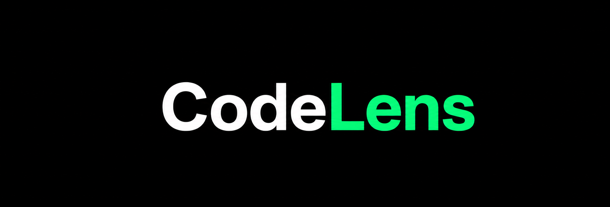
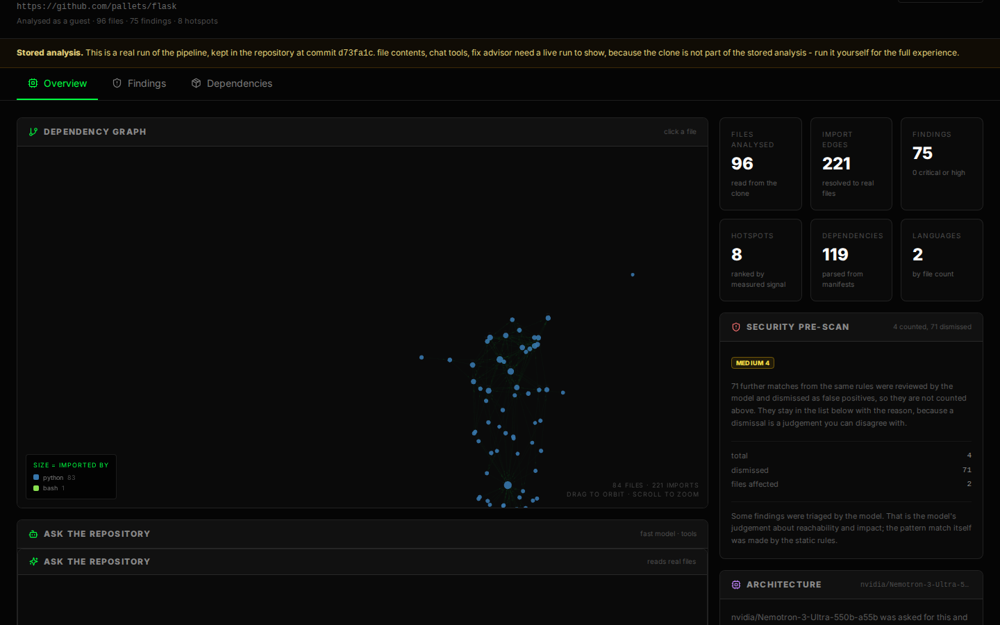
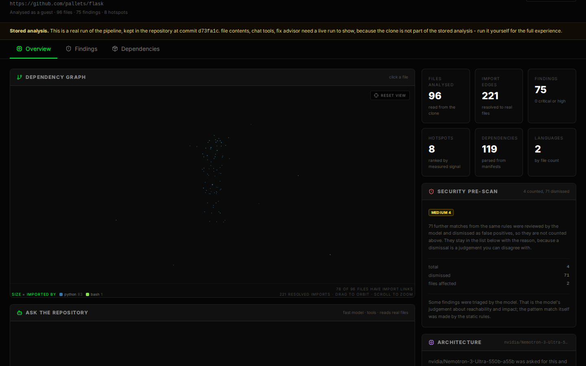
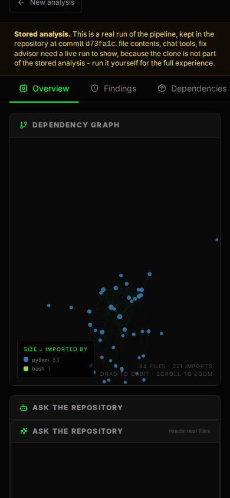
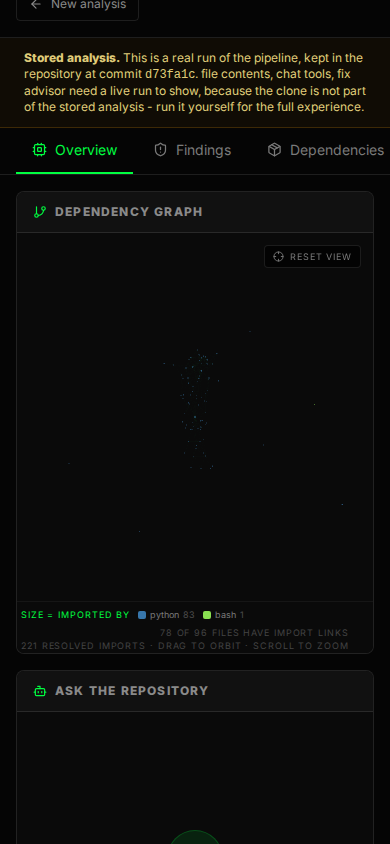
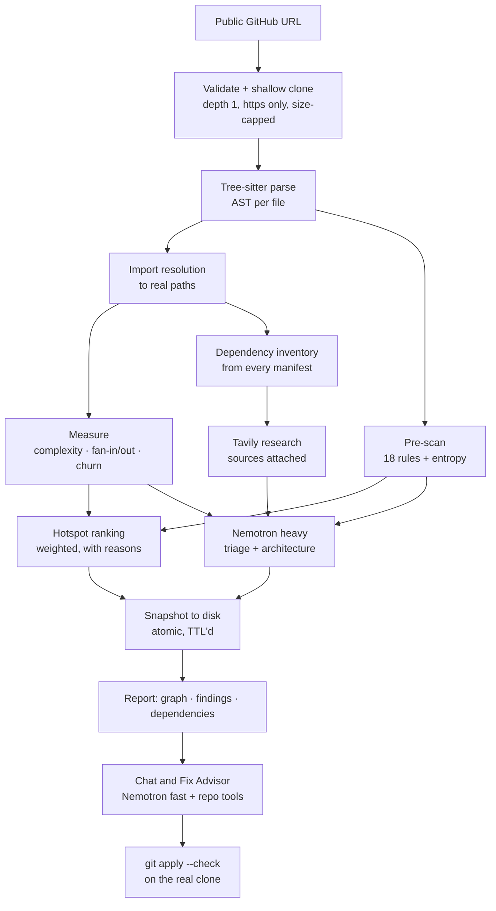

<p align="center">
  
</p>

<h3 align="center">CodeLens — read an unfamiliar codebase by its own numbers</h3>

<p align="center">
  Paste a public GitHub URL. Get the dependency graph, the files that are
  expensive to change, the dependencies worth looking at, and a patch that is
  checked against the real repository before you see it.
</p>

<p align="center">
  <a href="#quick-start">Quick start</a> ·
  <a href="#what-changed">What changed</a> ·
  <a href="#models">Models</a> ·
  <a href="#how-it-works">How it works</a> ·
  <a href="#limitations">Limitations</a> ·
  <a href="docs/DEPLOY_NEBIUS.md">Deploy</a>
</p>

---

## The idea

Static analysis tells you what a codebase *is*. A language model tells you what
it *means*. Most tools pick one and blur them, so a confident sentence about a
file nobody read looks the same as a measurement of a file that was parsed.

CodeLens keeps them apart:

* **Measurement first.** Tree-sitter parses the files. Imports are resolved to
  real paths. Complexity, fan-in, fan-out, churn and 18 security rules are
  computed. None of it is a model opinion.
* **Then the model argues.** The heavyweight Nemotron reviews the findings that
  the scanner actually located, explains the architecture, and drafts the patch.
  It is given a short list of located candidates instead of a whole repository,
  so it has something specific to disagree with.
* **And every claim carries its evidence.** A finding shows the file and line
  that produced it, the model that triaged it, and the source links behind it if
  web research ran. Without research it says `unverified` rather than inventing
  a CVE number.

The third point is the one that matters. A judge can check any claim in the
report against the repository, and a claim that was not verified is labelled as
such.

## Try it without an account

The landing page has a **Try a demo repo** button that opens analyses committed
to this repository under [`server/demo/`](server/demo). No clone, no model call,
no waiting — the whole report renders in one request. The reports are real runs
of the pipeline, each pinned to the commit it analysed.

| Demo | Files | Graph edges | Hotspots | Findings |
| --- | --- | --- | --- | --- |
| [flask](server/demo/flask.snapshot.json) (`d73fa1c`) | 96 | 195 | 8 | 74 |
| [zod](server/demo/zod.snapshot.json) (`004d800`) | 250 | 138 | 8 | 37 |

The two cases were chosen on purpose: a Python project and a TypeScript one, so
the import resolver is exercised by two different module systems.

A stored demo has no clone on disk, so file contents, chat tools and the Fix
Advisor are unavailable for it. The report says which, instead of failing when
you click.

---

## Quick start

Two processes: an API and a static frontend. Python 3.11+ and Node 20+.

```bash
# 1. API
cd server
python -m venv venv && source venv/bin/activate     # Windows: venv\Scripts\activate
pip install -r requirements.txt
cp .env.example .env                                  # optional: it runs with no keys
uvicorn main:app --reload                             # http://localhost:8000
```

```bash
# 2. Client, in a second terminal
cd client
npm install
cp .env.example .env.local
npm run dev                                           # http://localhost:3000
```

Then open <http://localhost:3000>. With no keys the API still parses repositories
and builds graphs; the landing page's status panel says so instead of the
report pretending otherwise.

Verify:

```bash
curl -s localhost:8000/health | python3 -m json.tool
curl -s localhost:8000/api/demo | python3 -m json.tool
```

Interactive API docs are at <http://localhost:8000/docs>.

### To get the model features

```bash
# server/.env
NEBIUS_API_KEY=...                                    # https://tokenfactory.nebius.com/
TAVILY_API_KEY=...                                    # https://app.tavily.com/home
```

Restart the API. `curl -s localhost:8000/health` will show
`llm.configured: true`. Full environment reference:
[`server/.env.example`](server/.env.example) and the table in
[docs/DEPLOY_NEBIUS.md](docs/DEPLOY_NEBIUS.md#5-environment-variables).

The client needs one value, `NEXT_PUBLIC_API_BASE_URL`. Firebase is optional and
only adds per-account history; without it the app runs in guest mode, which is
how the public deployment runs.

### Tests

```bash
cd server && pip install pytest && pytest tests/ -q     # 237 tests, no keys needed
cd client && npx tsc --noEmit && npm run build
```

The suite runs with `NEBIUS_API_KEY` and `TAVILY_API_KEY` deliberately unset, so
it passes in exactly the state a judge cloning this repository is in. CI runs it
on Python 3.11 and 3.12, plus the TypeScript check, the build, and a credential
scan — [`.github/workflows/ci.yml`](.github/workflows/ci.yml).

---

## What changed

The project existed before 26 August 2026 and was substantially rebuilt. The
original version parsed repositories, drew a graph, and had a chat box; it also
described itself in this README as using Google Gemini with ChromaDB embeddings,
which was not what it did. Rather than patch that, the analysis pipeline was
replaced with one whose output can be checked.

**The dependency graph actually resolves imports.** This was the quietest bug in
the project: a resolver that fails looks exactly like a resolver that found
nothing, so zod's 226 files reported *two* edges. Two causes, both now fixed and
pinned by tests — TypeScript under NodeNext names the emitted file, so
`from "./parse.js"` points at `parse.ts` on disk; and a Python package is
`__init__.py`, not `index.js`. zod now has 138 edges. An earlier version of the
graph view also injected a synthetic hub node wired to every file, which made the
picture look connected while hiding the real fan-in that hotspots are computed
from. That node is gone.

**The dependency graph panel is framed, not cropped, and its hub is dead
centre.** It was drawn into a canvas the size of the browser window inside a
panel a third of that width, so the picture was a top-left crop, and the camera
was never fitted to the layout at all — the effect that was supposed to do it
ran before the graph object existed and never ran again. The canvas is now
sized to its container; before it was always the size of the browser window,
44% wider than the panel it had to fit inside.

The camera is aimed at the **hub** — the file the most other files connect to
(`tests/.../inner2/flask.py` in flask, connected to 42 of 83 others;
`packages/bench/metabench.ts` in zod, 47 of 225) — because a point on the view
axis always renders at the exact centre of the projection, so the hub's position
is chosen rather than solved for and cannot drift afterwards. Measured on the
built client in real Chromium, the hub's projected position equals the canvas
centre with 0.00 px error across all six viewports, and a marker sphere drawn
at the hub's own coordinates lands within 0.50 px of it — the quantisation floor
of a pixel grid. The remaining unknown, how far back the camera has to stand for
the furthest file to stay inside the panel, is solved against what the renderer
actually projects: after the layout stops, again whenever the panel is resized or
comes back from being collapsed, and on "Reset view". The trade is deliberate —
the drawing is no longer centred on its own extent, so a hub sitting off to one
side of the cloud leaves the picture lopsided around it.

Pixel-checked the same way: across flask (84 files), zod (226) and a real
20-file analysis of `pallets/itsdangerous`, at 1440×900 and 390×844, the canvas
fits inside its panel, nothing is drawn past the canvas, and the drawing spans at
least 40% of the panel's shorter side in all six cases — the worst before was
59% of the panel's height off its centre. Before and after, at both sizes, is in
[`docs/screenshots/`](docs/screenshots):

| | before | after |
| --- | --- | --- |
| flask, 1440×900 |  |  |
| flask, 390×844 |  |  |

**The pre-scan is real, and it runs.** 18 deterministic rules — committed
credentials, AWS keys, PEM private key blocks, GitHub and Slack tokens, unsafe
deserialization, `eval`/`exec`, shell and SQL injection, path traversal, weak
hashes, insecure randomness, disabled TLS verification, `alg: none` JWTs,
wildcard CORS. Each finding is anchored to a file and a line. Writing the tests
for these found that the entropy detector had never executed: its regex was
written across five source lines, so the trailing newline was part of the
pattern and nothing could ever match it.

**Findings are grounded, or marked as not.** Dependency and advisory verdicts go
through Tavily and carry source links. Where a claim could not be checked, the
UI says `unverified` — it does not fill the gap with a plausible CVE.

**The assistant can read the repository.** Three tools — read a file, search the
code, list what a file depends on — so answers come from the clone the analysis
was built from rather than from context that was pasted in. Reads are
byte-capped and confined to the repository root.

**The Fix Advisor produces a diff that applies.** The model writes a unified
diff, and the server runs `git apply --check` against the real clone before
returning it. If it does not apply, the response says so and shows why. A patch
you cannot apply is a suggestion, not a fix.

**Analysis survives a restart.** Snapshots used to live in a temporary directory
that a container recycle would empty, so the chat and fix endpoints failed for a
repository you had just analysed. They now go to `CODELENS_DATA_DIR`, are
written atomically, and expire on a TTL along with their clone.

**No login wall.** Guest mode is the default. A guest is identified by a hash of
the client address, which is enough for per-client rate limits. Google sign-in
still works and is still optional; set `CODELENS_REQUIRE_AUTH=true` to require it.

**Judges can open a report in one click,** from the demos committed here, and the
landing page reports what the running instance can actually do by asking
`/health` rather than asserting it.

---

## How it works



| Stage | What it does | Model involved |
| --- | --- | --- |
| Clone | public github.com only, over https, depth 1, refused above `CODELENS_MAX_REPO_MB` and removed again | no |
| Parse | Tree-sitter grammars for 21 languages, 19 reachable by file extension; anything else still walks as text | no |
| Graph | resolves each import to a file, including TS NodeNext emitted extensions, Python packages and directory imports | no |
| Measure | cyclomatic complexity, fan-in, fan-out, LOC, commit churn | no |
| Pre-scan | 18 rules plus a Shannon-entropy check for credential-shaped assignments | no |
| Hotspots | weighted sum of complexity 0.28, churn 0.24, fan-in 0.20, findings 0.18, size 0.10, each with stated reasons | no |
| Dependencies | parsed from `package.json`, lockfiles, `requirements.txt`, `pyproject.toml`, `Gemfile`, `go.mod`, `Cargo.toml` and others | no |
| Research | Tavily grounds version and advisory claims, returns sources | Tavily |
| Review | triage of located findings, architecture summary, hotspot explanations | Nemotron heavy |
| Chat | streaming answers with tool calls against the clone | Nemotron fast |
| Fix | unified diff, validated with `git apply --check` | Nemotron heavy |

A model never decides what the numbers are. It is asked to explain and to
disagree.

### Endpoints

| Method | Path | Purpose |
| --- | --- | --- |
| `GET` | `/health` | what this instance can do right now — models, research, auth mode, storage |
| `GET` | `/docs` | OpenAPI docs |
| `POST` | `/analyze/stream` | run an analysis, streaming progress over SSE |
| `GET` | `/analyze/inspect` | which model the pipeline will use, and whether it is available |
| `POST` | `/chat` | one answer, JSON |
| `POST` | `/chat/stream` | one answer, streamed |
| `POST` | `/api/fix` | propose a validated patch for a finding |
| `POST` | `/repo/file` | read one file from the analysed clone |
| `GET` | `/api/models` | the models this instance calls, plus what the account can use |
| `GET` | `/api/config` | feature flags for the client |
| `GET` | `/api/demo` · `/api/demo/{slug}` | the stored analyses, no clone, no model call |
| `GET` | `/api/analysis/{repo_id}` | re-read a stored analysis from disk |

---

## Models

Built for the [Nebius × NVIDIA Global AI Hackathon](https://devpost.com/).
Every model call goes to **Nebius Token Factory** through one client
(`server/app/core/llm.py`); no other inference provider is used anywhere.

| Role | Default model | Used for | Why this one |
| --- | --- | --- | --- |
| Heavy | `nvidia/Nemotron-3-Ultra-550b-a55b` | finding triage, architecture summary, hotspot explanations, Fix Advisor diffs | 550B A55B MoE with a **1M-token context**, so a large repository is analysed in few very large calls instead of being aggressively truncated |
| Fast | `nvidia/Nemotron-3_5-Lightning` | chat, tool calls, streaming, per-file triage | cheapest tier at $0.06/$0.24 per 1M tokens — about 60× cheaper on input than Ultra — with a 1M context and the highest published throughput of the cheap models |

Both are overridable with `NEBIUS_MODEL_HEAVY` / `NEBIUS_MODEL_FAST`, and
`/api/models` reports whatever is actually configured rather than the default.

The split is the hackathon's brief made concrete: the larger model where
judgement over the whole repository is needed, the smaller one for the
high-volume interactive path, so the dashboard stays responsive.

The client is the standard `openai` Python SDK pointed at
`https://api.tokenfactory.nebius.com/v1/`, because Token Factory is
OpenAI-compatible. On top of it: bounded retries with exponential backoff that
honours `Retry-After` (rate limits are rolling 15-minute buckets that scale
automatically, and 429 is expected rather than exceptional), a client-side
concurrency limiter, per-request timeouts, JSON parse-and-repair with a retry
that drops the schema rather than losing the result, and key redaction on
everything returned or logged.

### Web research

Dependency and advisory claims are checked live through **Tavily** rather than
recalled. Every answer carries the sources it came from, and the model is
instructed to treat a search result as a citation, not as a verdict. Without a
Tavily key the analysis still runs and unverified rows are labelled.

---

## Security

The API clones repositories chosen by anonymous users, so the input boundary is
the part worth reading.

* **URLs are validated, not trusted.** Only `https://github.com/<owner>/<repo>`,
  exactly two path segments, no credentials, no port, no query, no fragment, no
  traversal, and names matching a conservative pattern. Twenty hostile forms are
  pinned as refused in `tests/test_ingestion.py`, including `github.com.evil.com`,
  a dash-prefixed name that git would read as an option, and a `;rm -rf /`
  fragment.
* **File reads are confined.** Every path is `realpath`'d and checked with
  `os.path.commonpath` against the clone root *after* symlinks are followed, so a
  symlink out of the repository is refused rather than served.
* **Clones are bounded** in time and size, shallow by default, with
  `GIT_TERMINAL_PROMPT=0` so a private repository fails fast instead of hanging
  on a credential prompt. An oversized clone is deleted before anything parses it.
* **Per-client rate limits** on analysis, chat, fixes and file reads, with
  `Retry-After` on a 429. Identical concurrent requests for the same repository
  share one run instead of queueing five clones.
* **Snapshots are written atomically** through a temporary file and
  `os.replace`, so a reader never sees a half-written analysis.
* **The key is never logged.** `describe()` returns configuration without the
  key, and `_redact()` scrubs it from anything returned or logged.

## Limitations

Stated here rather than discovered by a judge.

* **The pre-scan is pattern matching, not a vulnerability database.** It finds
  candidates for review. The UI says so, and a finding is a starting point, not
  a confirmed issue.
* **No commit history beyond 40 commits by default.** Churn is therefore recent
  churn. `CODELENS_GIT_HISTORY_DEPTH` deepens it at a cost.
* **Repositories are capped** at 250 files, 200 KB per file and 300 MB per
  clone. A larger repository is analysed partially and the result is marked
  `truncated`, and a truncated result is never served from cache.
* **Dynamic languages are under-measured.** Import resolution and complexity
  both depend on the grammar. A file in a language without one is still walked as
  text, which means fewer facts about it, not wrong facts.
* **The Fix Advisor is validated, not trusted.** `git apply --check` proves a
  patch applies cleanly to the analysed commit. It does not prove the patch is
  correct, and a model can still write a change that applies and is wrong. Read
  it before you merge it.
* **Triage is only as good as the triage prompt.** It sees located candidates,
  not the whole codebase, and it is told it may disagree with the scanner. Check
  the evidence line.
* **Chat answers are model output.** They cite files and lines from the clone,
  which is checkable, but a confident answer can still be wrong.

## Project layout

```text
CodeLens/
├── server/                     FastAPI service
│   ├── main.py                 HTTP layer, SSE progress, CORS
│   ├── app/core/
│   │   ├── parser.py           Tree-sitter: AST, complexity, imports
│   │   ├── graph.py            import → file resolution, fan-in/out
│   │   ├── hotspots.py         weighted ranking with stated reasons
│   │   ├── security.py         18 rules + entropy check
│   │   ├── ingestion.py        URL validation, clone, snapshots, expiry
│   │   ├── llm.py              the only Token Factory client
│   │   ├── research.py         Tavily grounding
│   │   ├── chat_service.py     context selection, map-reduce
│   │   ├── code_tools.py       read_file / search_code / list_dependencies
│   │   ├── fix_advisor.py      diff + git apply --check
│   │   ├── demo.py             serves the stored analyses
│   │   ├── auth.py             optional Firebase, guest mode otherwise
│   │   └── limits.py           rate limits, analysis registry
│   ├── prompts/                the prompts, as files
│   │   ├── triage_prompt.txt   security verdict for one located finding
│   │   ├── architecture_prompt.txt
│   │   ├── chat_prompt.txt
│   │   └── fix_advisor_prompt.txt
│   ├── demo/                   committed analyses for the demo button
│   ├── scripts/build_demo.py   regenerates server/demo/
│   ├── tests/                  237 tests, no network
│   └── Dockerfile              two-stage, runs as uid 10001
├── client/                     Next.js static export
│   └── src/
│       ├── app/                landing, dashboard, results
│       ├── components/         LandingPage, HeroSection, GraphView, AIChat
│       ├── hooks/              useAuth
│       └── lib/                api.ts, session.ts, firebase.ts
├── assets/                     README banner and landing screenshots
├── docs/
│   ├── screenshots/            the dependency graph panel, before and after
│   ├── PLATFORM_NOTES.md       verified platform facts, with sources
│   ├── DEPLOY_NEBIUS.md        deployment, env reference, verification
│   └── TEST_REPORT.md          real end-to-end results
└── SUBMISSION.md               hackathon submission fields
```

## Credits and disclosure

CodeLens was built with AI assistance. The `Documentation` page that previously
claimed specific contributions from Claude, Codex, Gemini and Copilot was
removed: it linked to a page that no longer existed, described a storage approach
that had been replaced, and attributed work this repository cannot evidence.
Accurate tool attribution is worth less than no claim at all.

Platform documentation consulted is listed with sources in
[`docs/PLATFORM_NOTES.md`](docs/PLATFORM_NOTES.md). No model was asked to
contribute a CVE identifier, a version number or a file path; those are read from
the code or from Tavily.

Every behaviour claim above is traced to a request in
[`docs/TEST_REPORT.md`](docs/TEST_REPORT.md), including the thirteen failures
that only appeared once it was run against the live API. If you are submitting
this project, [`SUBMISSION.md`](SUBMISSION.md) has the links and the video script.

## Licence

[MIT](LICENSE) © 2026 Aditya Raj
