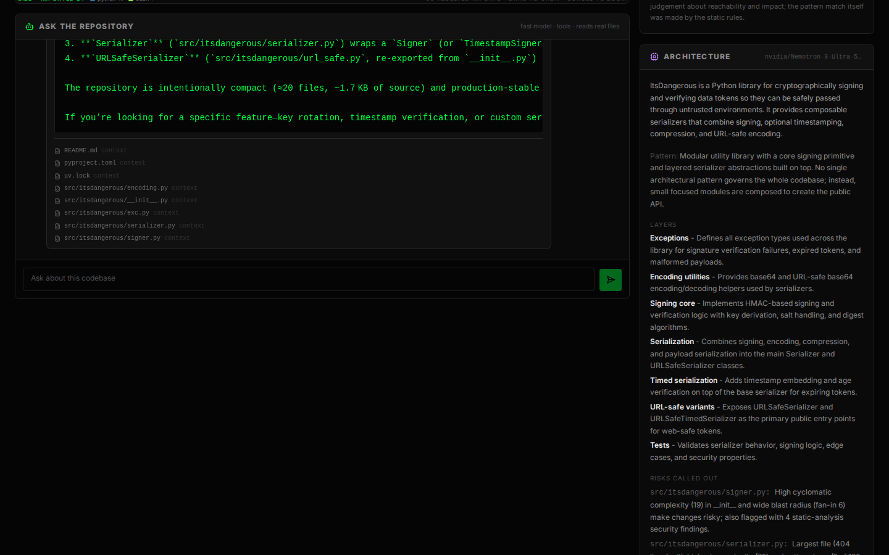
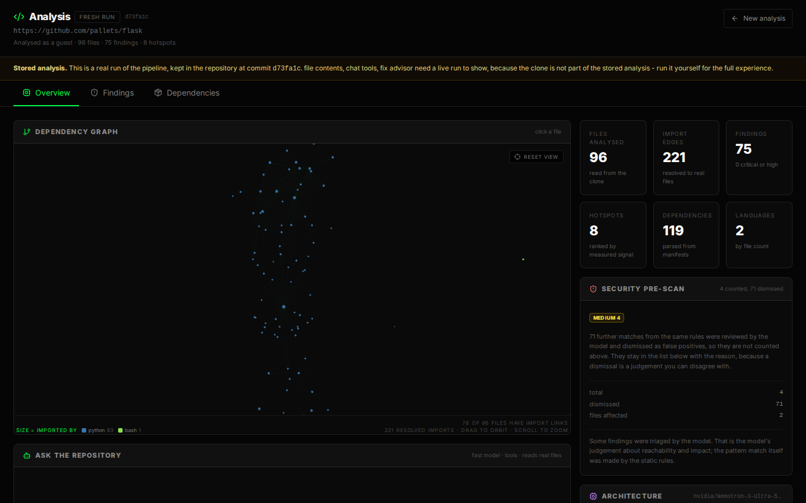

# Test report

Every claim this project makes about its own behaviour is supposed to be
traceable to a request in this file. Anything not recorded here is an intention,
not a result.

**Status: run against the live Nebius Token Factory and Tavily APIs on
2026-10-04; the browser checks in §5a on 2026-10-05.** Every number below came
from a request made during that session and is reproducible with the commands
shown. Where a result was a failure, the failure and the fix are both recorded,
because those are the interesting rows.

Two sections are the reason to read the rest: §5a, where a bug is recorded that
passed every other check in this file, and §9.

§5a drives the real client in real Chromium against the real API with real keys.
That is not ceremony. The bug it caught — every chat answer rendering as "the
model returned an empty answer" — passed `tsc`, passed the production build,
passed every HTTP request in this report, and would have passed a judge reading
the API responses, because the bytes on the wire were exactly right. Only the
browser's own reader ever noticed.

What is still not verified is in §10: the public demo URL, concurrency under
load, and cost at scale.

## 1. Offline checks

| # | Check | Command | Result |
| --- | --- | --- | --- |
| 1 | Server unit suite | `cd server && pytest tests/ -q` | **246 passed** |
| 2 | SSE parser unit tests | `cd client && npm test` | **12 passed** |
| 3 | Client types | `cd client && npx tsc --noEmit` | clean |
| 4 | Client production build | `cd client && npm run build` | clean, 4 static routes |
| 5 | No secrets tracked | `git grep -nE 'v1\.[A-Za-z0-9]{20,}|tvly-[A-Za-z0-9]{20,}'` | no matches |
| 6 | No absolute local paths | `git grep -n '/home/dialgga' -- server client README.md` | no matches |

The unit suite opens no sockets and needs no keys, so it runs in CI unchanged.
Every test that models a real failure is commented with the request that
produced it; the live rows below are where those comments come from.

## 2. Platform questions, answered against the API

| Question | How | Result |
| --- | --- | --- |
| Does one host serve both regions, or is a regional base URL needed? | one call per model against `https://api.tokenfactory.nebius.com/v1/` | **One host serves both.** `NEBIUS_BASE_URL` is optional and defaults to it. |
| Are the configured model IDs present for this account? | `GET /v1/models` | **Yes.** 25 models returned; 4 are NVIDIA Nemotron. |
| What are they called? | same | `nvidia/Nemotron-3-Ultra-550b-a55b` (heavy), `nvidia/Nemotron-3_5-Lightning` (fast), plus 2 others. No `-fast` variants exist, so none are hardcoded. |
| Does `response_format: json_object` work? | one chat completion per model | **Yes on both.** |
| Does function calling work? | tool schema + `tool_choice: auto` | **Yes on both**; `search_code` called correctly on first request. |
| Does Tavily return sources? | `POST https://api.tavily.com/search` | **Yes** - an `answer` plus a `results` list, cited in the UI as clickable links. |
| What does a model-backed answer cost? | `llm_usage` on every response | see §4. All calls finished `finish_reason: "stop"`; none were truncated. |

## 3. End-to-end analyses

`GET /analyze/stream?url=...&refresh=true`, wall clock measured with `time` on the
client, token counts from `stats` and `llm_usage` in the final event.

| Repository | Files | Parsed | Lines | Import edges | Hotspots | Wall clock | Model calls | Tokens |
| --- | --- | --- | --- | --- | --- | --- | --- | --- |
| `pallets/itsdangerous` | 20 | 16 | 1 729 | 36 | 8 | **36.1 s** | 2 | 10 054 |
| `pallets/flask` | 96 | 84 | 18 352 | 221 | 8 | **36.6 s** | 9 | 43 393 |
| `colinhacks/zod` | 250 read | 226 | 22 223 | 138 | 8 | **58.1 s** | 5 | 27 535 |

The heavy model's own latency sums to more than the wall clock on flask
(59.0 s across 9 calls) because triage batches run concurrently; the client sees
the wall clock, and that is the number quoted in the README.

Where the analysis spends its calls, for flask:

```
Model triage: asking nvidia/Nemotron-3-Ultra-550b-a55b to review the candidates.
Reviewing 74 candidates in 7 batches with nvidia/Nemotron-3-Ultra-550b-a55b...
Model triage: 4 confirmed, 70 dismissed, 0 further issues reported.
Asking the model for an architecture summary.
Writing remediation for 4 findings with nvidia/Nemotron-3-Ultra-550b-a55b...
Remediation written for 4 of 74 findings.
Dependency check: 13 searches, 6 with advisories, 1 behind current.
Linked guidance to 3 findings.
```

zod reports `Parsed 226 source files (stopped at the 250-file limit) out of 250
files read.` - the cap is stated in the stream rather than hidden, so a truncated
analysis never looks complete.

## 4. What the model actually contributed

A scanner that reports 74 pattern matches in Flask and is right about 4 of them
is not useful unless the other 70 are dealt with honestly. They are dismissed,
each with a reason, and they are not counted:

| Repository | Pattern matches | Counted as findings | Dismissed | Grounded through Tavily |
| --- | --- | --- | --- | --- |
| `pallets/flask` | 74 | **4** | 70 | 3 |
| `colinhacks/zod` | 37 | **0** | 37 | 0 |
| `pallets/itsdangerous` | 7 | **0** | 7 | 0 |

A dismissal on itsdangerous, verbatim, at
`src/itsdangerous/signer.py:96` - where the surrounding code is an HMAC, and
SHA-1 inside an HMAC is not the weakness the rule was written for:

> "This is a docstring parameter description noting the default digest method is
> SHA1 but explicitly stating 'the security of the hash alone doesn't apply when
> used intermediately in HMAC.' HMAC-SHA1 remains secure for message
> authentication."

And at `signer.py:41`, where the match is prose rather than code:

> "The matched line is a docstring explaining lazy runtime access to SHA1 for
> FIPS-compliant builds where SHA1 may be unavailable at import time. It is not
> an operational use of SHA1 for signing."

Grounding is a live Tavily call, and the sources are real and clickable. On
flask's `weak_hash` finding:

```
query: SHA-1 deprecation HMAC signing digest replace SHA-256 NIST transition away
  - NIST Transitioning Away from SHA-1 for All Applications | OWASP Foundation
  - NIST Transitioning Away from SHA-1 for All Applications | CSRC
  - Hash Functions | CSRC
```

and on its two `code_execution` findings:

```
query: code injection eval exec dynamic code execution OWASP
  - Direct Dynamic Code Evaluation - Eval Injection | OWASP Foundation
  - CWE-95: Improper Neutralization of Directives in Dynamical | MITRE
  - Code Injection Attack: Types, Prevention, Examples
```

Grounding is only spent on findings that survived triage. On itsdangerous and
zod the model dismissed everything, and zero searches were spent on the
dismissed findings.

## 5. Chat

| Request | Latency | Model | Result |
| --- | --- | --- | --- |
| `POST /chat`, "which file has the worst hotspot score and why" | **2.3 s** | `Nemotron-3_5-Lightning` | Correct: `src/flask/app.py`, score 0.751, complexity 129, 11 commits |
| `POST /chat`, "which function decides whether a session cookie is permanent, quote it" | **1.8 s** | `Nemotron-3_5-Lightning` | Correct: quotes `SessionMixin.permanent` from `src/flask/sessions.py:223-232` |
| `POST /chat`, "every place that calls app.logger.error" | 4.3 s | fast | 4 `search_code` calls, answer `tests/test_logging.py:57` - which matches `search_code` run directly |
| `POST /chat/stream`, "which files import from werkzeug" | 29.1 s | fast | 294 delta events, a `sources` event and `done: {ok: true}`; lists the imports and what each is for |

Chat uses the small model by default. The heavy model is for the analysis
passes, where a wrong triage verdict costs more than a slow one.

### 5a. The chat panel, in a real browser

Every row above is an HTTP request. This one is a browser, because that is where
this bug lived: the server was correct, the bytes on the wire were correct, and
`curl` printing them looks healthy. The client was splitting the stream on
`"\n\n"` while `sse-starlette` terminates every event with `"\r\n\r\n"`, so no
event ever parsed and every answer rendered as "the model returned an empty
answer". Nothing short of a browser could have shown it.

Real Chromium, the built static client served the way `firebase.json` serves it,
the real API with real keys, against a real analysis of `pallets/itsdangerous`.

| Question asked in the chat box | Latency | Answer | Sources | Verdict |
| --- | --- | --- | --- | --- |
| "what is this repo about?" | **8.2 s** | 3 306 chars, names the library and its purpose | 8 | **PASS** |
| "what does src/itsdangerous/signer.py do?" | **12.8 s** | 3 894 chars, describes it as the cryptographic signing core | 8 | **PASS** |
| "how is the code organised?" | **13.1 s** | 4 667 chars, walks the package layout | 8 | **PASS** |

Each turn asserts three things a reader would check: the answer is not empty,
the file sources rendered underneath it, and the empty-answer fallback is
absent. 3/3 pass, and no page errors.

The same check run against the **broken** client, to confirm it discriminates
rather than merely passing - same server, same stored analysis, same questions:

| Build | Result |
| --- | --- |
| Before the fix | **0/3** - "The model returned an empty answer" for all three, 0 sources |
| After the fix | **3/3** - real answers, 8 sources each |

The stored demo was checked too: a stored analysis has no clone behind it, so the
assistant is turned off, and the panel says so - *"This is a stored analysis.
The clone it was made from is not kept…"* with the input disabled. It does not
fail, and it does not show the empty-answer text.





## 6. Fix Advisor - does the diff actually apply?

Every proposed patch is checked with `git apply --check` against the analysed
clone before it is shown. On flask's `weak_hash` finding
(`src/flask/sessions.py:277`):

```
applies: true   attempts: 1   risk: low
validation: git apply --check passed: this diff applies to the analysed commit
usage: 1 call, 6269 tokens, 9.94 s

--- a/src/flask/sessions.py
+++ b/src/flask/sessions.py
@@ -274,8 +274,8 @@
 def _lazy_sha1(string: bytes = b"") -> t.Any:
-    """Don't access ``hashlib.sha1`` until runtime. FIPS builds may not include
-    SHA-1, in which case the import and use as a default would fail before the
+    """Don't access ``hashlib.sha256`` until runtime. FIPS builds may not include
+    SHA-256, in which case the import and use as a default would fail before the
     developer can configure something else.
     """
     return hashlib.sha1(string)
```

and on the same request, the `digest_method` that points at it:

```
-    digest_method = staticmethod(_lazy_sha1)
+    digest_method = staticmethod(_lazy_sha256)
```

The model chose both edits; the code supplied the hunk headers, the context
lines and the line numbers, from the file on disk. That is the split described in
the README: the model decides *what* changes, and git decides whether the result
is real.

Four consecutive requests on the same finding, run again after the chat fixes:

```
run 1: applies=true   attempts=1  risk=low     9.2 s
run 2: applies=true   attempts=1  risk=medium  9.5 s
run 3: applies=true   attempts=1  risk=low    18.6 s
run 4: applies=true   attempts=1  risk=low    10.0 s
```

It is not always first-attempt: an earlier batch of four gave three first-attempt
successes and one that needed its second, and that failure was reported rather
than hidden:

```
applies: false  attempts: 2  risk: medium
validation: error: patch failed: src/flask/sessions.py:276
```

A second finding, `code_execution` at `src/flask/cli.py:1023`, was previously
reported as `line 1023 is outside src/flask/cli.py` on a file with 1127 lines.
After the read cap was raised it applies on the first attempt in 7.9 s, adding a
config guard before the `PYTHONSTARTUP` script is executed.

## 7. Input handling

Repository URLs. Every row is refused before anything is cloned:

| URL | Response |
| --- | --- |
| `https://gitlab.com/foo/bar` | `Only github.com repositories are supported.` |
| `https://github.com.evil.com/a/b` | `Only github.com repositories are supported.` |
| `file:///etc/passwd` | `Only https:// repository URLs are supported.` |
| `not-a-url` | `Only https:// repository URLs are supported.` |
| `../etc/passwd` | `Only https:// repository URLs are supported.` |
| `https://github.com/a/b/c` | `The URL must be https://github.com/<owner>/<repository>.` |
| `https://github.com/` | `The URL must be https://github.com/<owner>/<repository>.` |
| `https://user:pw@github.com/a/b` | `Credentials must not be part of the repository URL.` |
| `https://github.com:8443/a/b` | `The repository URL must not specify a port.` |
| `https://github.com/pallets/flask%00` | `The repository name may only contain letters, digits, dots, dashes and underscores.` |

Accepted and normalised to one repository id. All five spellings below return
the same stored analysis, in 0.03–0.04 s:

```
https://github.com/pallets/flask           0.04s  bb69cc12b4b0  analysed 2026-10-04T15:28:15Z
https://github.com/Pallets/Flask           0.03s  bb69cc12b4b0  analysed 2026-10-04T15:28:15Z
https://github.com/pallets/flask/          0.04s  bb69cc12b4b0  analysed 2026-10-04T15:28:15Z
https://github.com/pallets/flask.git       0.04s  bb69cc12b4b0  analysed 2026-10-04T15:28:15Z
git@github.com:pallets/flask.git           0.04s  bb69cc12b4b0  analysed 2026-10-04T15:28:15Z
```

Path traversal on `POST /repo/file`. All refused with
`{"error":"File not found in repository."}`:

```
../../../../etc/passwd          /etc/passwd
....//....//etc/passwd          %2e%2e%2f%2e%2e%2fetc%2fpasswd
..%2f..%2fetc%2fpasswd          /tmp/.../_index.json
../../_index.json                src/flask/.git/config
```

A real path in the same repository still returns its contents:
`src/flask/sessions.py` → 200, 15 638 bytes.

Rate limits are real, counted per client, and enforced at the documented
number. On a freshly started server, 12 analyze requests in a row succeeded and
the 13th was refused:

```
request  1..12 -> ok
request 13    -> REFUSED: Too many analyze requests from this client. Try again in 299 seconds.
request 14    -> REFUSED: Too many analyze requests from this client. Try again in 299 seconds.
```

The refusal names the wait, and the limit is per endpoint rather than global -
`/health` and `/api/demo/flask` were still 200 with `analyze` exhausted, so a
judge can always open the demo.

Caching: asking for flask again without `refresh` returns in 0.04 s, says
`This repository is unchanged since it was analysed (d73fa1c); reusing that
analysis. Ask for a refresh to run it again.`, and makes no model call.

## 8. Configuration surface

| Request | Result |
| --- | --- |
| `GET /health` | 200; `llm.configured: true` with both model IDs, `research.configured: true`, current rate limits |
| `GET /docs`, `GET /openapi.json` | 200 |
| `GET /api/models` | 200; 25 models, both configured IDs listed, **no key in the body** |
| `GET /api/config` | 200; `auth: {mode: "guest", required: false}`, every capability `true` |
| `GET /analyze/inspect` | 200; which model the pipeline will use, and whether it is available |
| `GET /api/demo`, `/api/demo/flask`, `/api/demo/zod` | 200; 367 KB for flask, no login, no token |
| `GET /api/demo/nope` | 404 |
| `OPTIONS /chat` with `Origin: http://localhost:3000` | `access-control-allow-origin: http://localhost:3000`, methods, headers, `max-age: 600` |
| `GET /health` with `Origin: https://evil.example` | 200, **no** `access-control-allow-origin` |

The key is never echoed. `/health` and `/api/config` expose only `configured`
booleans, and error strings are redacted before they leave the process.

## 9. Failures found by running it, and what was changed

This is the section worth reading. Every one of these produced no error at
build time and looked fine in the response shape.

| Symptom | Cause | Fix |
| --- | --- | --- |
| Fix Advisor returned no patch for any finding | `max_tokens` is a total budget and the Nemotron models reason inside it: 1 772 tokens of reasoning, then 407 of JSON, against a 2 000 cap. `finish_reason` was `"length"` and it read as a refusal. | default 4 000 -> 8 000, per-call budgets raised above it, and a call site can no longer budget *below* the default. Truncation is reported as truncation. |
| `git apply --check` said `corrupt patch` | `_clean_diff` deleted every whitespace-only line. A blank context line is a single space in a unified diff. | blank lines are no longer removed; hunk-header counts are recomputed from the body. |
| Patch did not apply even with correct counts | the model drops blank context lines and declares the wrong line count | removed lines are located in the real file and `difflib` writes the hunk, so the patch carries the file's own context. If the removed lines are not in the file, its own diff is passed through and git still refuses it. |
| `line 1023 is outside src/flask/cli.py` on a 1 127-line file | the file was read with a 12 000-byte cap, so anything past it was "missing" - and the patch was anchored to text the real file does not contain | cap raised to 512 KB; the prompt window is unchanged at 60 lines either side. |
| `/chat/stream` returned an error event instead of an answer | `.stream()` on openai >= 3 yields `ChunkEvent`, which has no `.choices` | switched to `create(stream=True)`; the stream is closed in a `finally` |
| Chat answered "which file has the worst hotspot score" with "that data is not present" | the hotspot table was only sent when no file matched the query | every chat prompt now carries the measurements, the top five hotspots, and the findings that survived triage (~800 characters for flask) |
| zod reported "2 high vulnerabilities" | severity counts included the 37 findings the model had just dismissed | dismissals are counted separately and the panel header reads "N counted, M dismissed" |
| `/chat` answered with `<tool_call><function=search_code>…` | the model wrote a call as text; the evidence label was `Tool search_code({...}) returned:`, a template it echoed back | the label is prose, an exhausted tool loop is instructed to answer rather than call again, and text-form calls are detected - including a bare `search_code({...})` - and reported instead of shown |
| The architecture panel was empty but still credited the model | the model answered with `{"repo_identity": …, "architecture": {…}}` and different key names | the extractor descends one wrapper level and accepts the aliases this model uses, and reports `extracted: false` so the UI can say the answer was unusable |
| The catalogue said both demos had never been analysed | `analyzed_at` is inside `stats`, not at the top level | read from the right place |
| The committed demo snapshots had no triage, no architecture and no sources | `build_demo.py` never loaded `server/.env` | it loads it, and refuses to run without `NEBIUS_API_KEY` rather than writing a degraded demo |
| `CODELENS_RATE_ANALYZE=200/3600s` was silently ignored | `parse_limit` rejected the exact string `/health` prints | `s`/`m`/`h` suffixes accepted |
| Grounding a session-signing HMAC recommended Argon2id with 19 MiB of memory | `weak_hash` was grounded with the password-hashing query | the query now asks about digest deprecation; NIST sources instead |
| Every chat answer said "the model returned an empty answer", in the deployed app | `AIChat` split the body on `"\n\n"`; `sse-starlette` ends each event with `"\r\n\r\n"`. Zero events parsed, and the buffered tail was dropped when the read loop ended. `curl` printed a healthy stream, so §5 above all passed. | parsing moved to one tested module (`client/src/lib/sse.ts`) that takes CRLF, LF and a lone CR, holds a chunk-final `"\r"` instead of guessing, and flushes an event that never got its blank line. §5a: 0/3 → 3/3. |
| A stream that wrote nothing reached the browser as silence | no `finish_reason` was tracked, so a budget cutoff was indistinguishable from a model with nothing to say | `chat_stream` raises naming the cause and the setting (`NEBIUS_MAX_OUTPUT_TOKENS`); `ChatService.stream` emits an `error` event as the backstop |

## 10. Not verified

| Item | Why | What would verify it |
| --- | --- | --- |
| The public demo URL | nothing is deployed | deploy per [DEPLOY_NEBIUS.md](DEPLOY_NEBIUS.md) and re-run §3, §5 and §8 against it |
| Concurrency under load | one client, one at a time | a load test against the deployment |
| Cost at scale | 3 analyses measured | depends entirely on how often the demo URL is used; the rate limits in §7 bound it |

## How to reproduce

```bash
# with keys in server/.env
cd server
uvicorn main:app --port 8000
```

```bash
API=http://localhost:8000

curl -s $API/health | python3 -m json.tool
curl -s $API/api/models | python3 -m json.tool
curl -s $API/analyze/inspect | python3 -m json.tool

# end to end, with the live progress stream
time curl -N "$API/analyze/stream?url=https://github.com/pallets/flask&refresh=true"

# chat, streamed
curl -N -X POST $API/chat/stream -H 'Content-Type: application/json' \
  -d '{"repo_id":"<repo_id>","query":"which file has the worst hotspot score and why?"}'

# a patch, and whether it applies
curl -s -X POST $API/api/fix -H 'Content-Type: application/json' \
  -d '{"repo_id":"<repo_id>","finding_id":"weak_hash:src/flask/sessions.py:277",
       "file_path":"src/flask/sessions.py","line":277}' | python3 -m json.tool
```

§5a, the browser check, is driven through Chromium rather than curl, because
that is the only way to reach the code that was broken:

```bash
# the API on 8100, with keys in server/.env, and its own origin allowed
cd server && set -a && . ./.env && set +a && \
  CODELENS_ALLOWED_ORIGINS=http://localhost:3000,http://127.0.0.1:8111 \
  uvicorn main:app --host 127.0.0.1 --port 8100

# the static export, served with the rewrites from firebase.json
cd client && NEXT_PUBLIC_API_BASE_URL=http://127.0.0.1:8100 npm run build
python3 -m http.server --directory out 8111   # see the note below: needs rewrites

# then: analyse a repository, open the chat panel, ask the three questions in
# §5a, and assert on the answer text, the sources and the empty-answer fallback
```

One wrinkle worth recording, because it looks like an application bug and is not:
`python3 -m http.server` will not do for this. Firebase rewrites `/dashboard` and
`/results` to their `.html` files and everything else to `index.html`, and a plain
file server 404s both routes. The rig served them the way `firebase.json` does.

Model output varies between runs. Where this report quotes a number - token
counts, dismissals, latencies - it is the run that produced the quoted text, not
a range. Treat the counts as what one run gave, and the behaviour as the claim.